Hi 👋 My name is AalbatrossGuy
==============================

<h2>Student Developer...</h2>

I am 19 years old and am interested in making my career in software development and/or Cloud Computing. I have been programming since I was 13 and have learnt quite a few languages and tech stacks over the years and I'm proficient in most of them. I code because computer and programming are my first love and I have no intention of dropping it anytime. If my contribution graph is empty, it doesn't mean I'm slacking off, it just means that I'm contributing to private repos 😌

→ I'm based in Asia.  
→ Freelancing since 2021.  
→ I'm currently working on [redivim](https://github.com/AalbatrossGuy/redivim).  
→ I'm learning the French Language (A2) and learning about [Computer Networks](https://csc-knu.github.io/sys-prog/books/Andrew%20S.%20Tanenbaum%20-%20Computer%20Networks.pdf).  
→ Hit me up for any collaborative projects.  
→ Addicted to music and water.  
→ Checkout my [gists](https://gist.github.com/AalbatrossGuy).  
→ Checkout my [server config file](https://github.com/AalbatrossGuy/VargoDotFiles).  

  
  

### Skills

### Socials

 

### Github Stats

  
  

  

